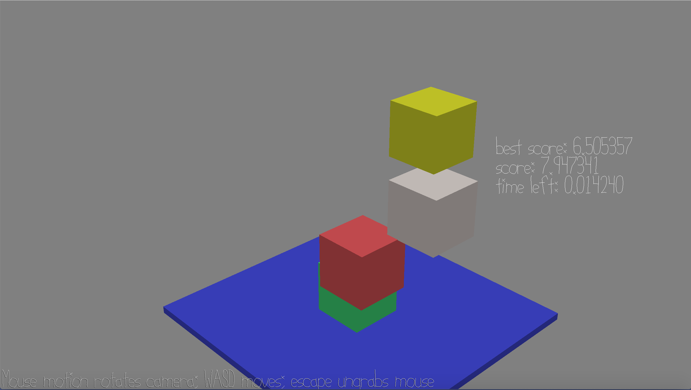

# Just A Tip

Author: Jianrong Yu

Design: This game is about reaction speed and controlling your greediness.

Screen Shot:

How To Play:

Your goal is to move the top 3 cubes in under 4 seconds to make their faces overlap as little as possible. Try to keep just the tips in touch.
The smallest the overlap, the higher the score.

If your cube is completely off you are out and the score won't be counted.

Use the direction keypad to control the cube. Press Q to move down a cube. Press E to move up a cube.

(You can move the lowest cube but it doesn't do anything)

Sources: All assests are my own.

This game was built with [NEST](NEST.md).

